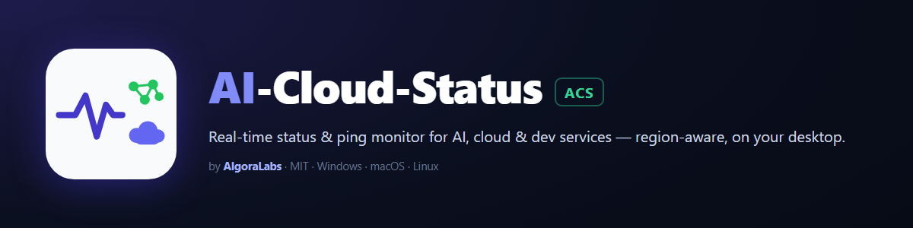

<p align="center">
  
</p>

# AI-Cloud-Status (ACS)

<p align="center">
  
  
  
  
  
  
  <a href="https://github.com/AlgoraLabs-AI/AI-Cloud-Status/releases/latest"></a>
</p>

A small cross-platform desktop **system-tray** app (Windows, Linux, macOS) that
runs quietly in the background and tells you, at a glance, whether **your
internet**, the **AI / cloud / dev services you depend on**, and **your own
endpoints** are healthy — with a colour-coded uptime strip you can scope to the
regions you actually care about.

It monitors:

- **Internet connectivity** — pings `1.1.1.1` and `8.8.8.8` (by default once a
  second — the cadence is configurable) and tracks rolling packet loss, with a
  distinct alert for a full outage. Packet loss is **consolidated across both
  resolvers**: a round counts as lost only when Cloudflare *and* Google miss it
  together, so a single flaky path never raises a false alarm.
- **AI / cloud / dev provider status** — polls the public status feeds of OpenAI,
  Anthropic, Cloudflare, GitHub, Google Cloud, Gemini, AWS, Azure, and (best
  effort) Mistral, Cohere, Hugging Face, Groq, and others.
- **Your own endpoints** — optional custom connectivity targets (IP/host) and
  custom URL checks.

Built with [Fyne](https://fyne.io) for the GUI and tray. The binary is `acs`
(`acs.exe` on Windows).

## Download

Grab the latest build from the
**[Releases page](https://github.com/AlgoraLabs-AI/AI-Cloud-Status/releases/latest)**:

| Platform | File | Status |
| --- | --- | --- |
| Windows (x64) | `AI-Cloud-Status-windows-amd64.exe` | Developed and tested here |
| Linux (x64) | `AI-Cloud-Status-linux-amd64.tar.gz` | Builds and its test suite passes in CI; the GUI has not been hand-verified |
| macOS (Apple Silicon) | `AI-Cloud-Status-darwin-arm64.tar.gz` (an `.app` bundle) | Hand-verified on macOS 26.5.2 / Apple Silicon |

`SHA256SUMS.txt` is published with every release — verify your download against
it (`sha256sum -c SHA256SUMS.txt`, or `Get-FileHash` on Windows). The binaries
are **not code-signed or notarized**, so Windows SmartScreen and macOS Gatekeeper
will warn on first launch — see [First launch on macOS](#first-launch-on-macos).

The Linux caveat is deliberate wording, not modesty: this app is developed on
Windows, and while CI runs the whole test suite on all three platforms before
publishing anything, nobody has yet sat in front of the GUI on a Linux desktop.
See [`devnotes/platform-coverage.md`](devnotes/platform-coverage.md) for exactly
what has been run where, and for the defect that pass found and fixed.

### First launch on macOS

The app is not signed with an Apple Developer ID and is not notarized, so
Gatekeeper **blocks it outright** on first launch. The dialog is a dead end by
design — its only two buttons are *Move to Trash* and *Done*, and there is no
"Open Anyway" in it:

> **"AI-Cloud-Status" Not Opened**
> Apple could not verify "AI-Cloud-Status" is free of malware that may harm your
> Mac or compromise your privacy.

Clear the download quarantine flag **before** you open it the first time:

```bash
tar -xzf AI-Cloud-Status-darwin-arm64.tar.gz
xattr -dr com.apple.quarantine AI-Cloud-Status.app
open AI-Cloud-Status.app
```

The order matters. Once Gatekeeper has refused a copy, removing the flag
afterwards does **not** release it — the app will keep launching to nothing.
If you have already hit the dialog, either re-extract the archive and clear the
flag on the fresh copy, or allow the blocked app under
**System Settings → Privacy & Security**.

If you would rather not run `xattr`, that is a reasonable call: it is the command
that tells macOS to stop asking, and you only have this project's word that the
binary is what it claims. Building from source (see [Build & run](#build--run))
produces a binary with no quarantine flag at all and needs no such step.

### It is portable — it runs from wherever you put it

There is no installer and nothing is written next to the executable. Drop
`AI-Cloud-Status-windows-amd64.exe` anywhere — Desktop, a USB stick, a tools
folder — rename it to `acs.exe` if you like, and double-click it. The app appears
in the system tray and keeps running when you close the window.

The same is true of `AI-Cloud-Status.app` on macOS: put it in `/Applications` or
leave it in `~/Downloads`, whichever you prefer. It is shipped as a bundle rather
than a bare binary because macOS types a bare executable as a Unix command and
opens it *through Terminal* — which left a stray terminal window owning the app,
so closing that window killed it.

### Where it stores your data

Everything the app remembers lives in **one folder in your user profile**, never
beside the executable and never anywhere else:

| OS | Folder |
| --- | --- |
| Windows | `%AppData%\AI-Cloud-Status\` (i.e. `C:\Users\<you>\AppData\Roaming\AI-Cloud-Status\`) |
| macOS | `~/Library/Application Support/AI-Cloud-Status/` |
| Linux | `$XDG_CONFIG_HOME/AI-Cloud-Status/` (or `~/.config/AI-Cloud-Status/`) |

A normal install writes exactly five things there, all of them your own state:

| File | What it is |
| --- | --- |
| `config.json` | Your settings: which checks are on, intervals, regions, mutes, language |
| `history.json` | The uptime strip's samples, so the last 24 h survives a restart |
| `incidents.json` | The incident journal behind "Incident history — last 24 h" |
| `open-outages.json` | Outages still open at shutdown, so their recovery alert is not swallowed |
| `instance.lock` | The single-instance guard |

**Nothing is sent anywhere.** The app talks to the services it monitors and to
GitHub's release API (for the update check) and to nobody else. There is no
telemetry, no analytics, and no account.

To uninstall completely: quit from the tray, delete the `.exe`, delete that
folder.

## Automatic updates

On launch (and every 6 hours) the app asks the GitHub Releases API whether a
newer version is published. If one is, a dialog offers it once — **Update now**
or **Later** — and you can also trigger the check by hand from **Help → Check
for updates**.

On Windows, *Update now* downloads the new build, verifies it against the
release's `SHA256SUMS.txt`, swaps it in and restarts into it; the previous
executable is deleted by the new one on its first run. On macOS and Linux the
release is an archive rather than a bare binary, so the app tells you a version
exists and links the release page instead of unpacking an archive over an install
it knows nothing about.

Three rules the updater will not bend (see [`internal/updater`](internal/updater)):

- **HTTPS to GitHub hosts only**, re-checked on every redirect.
- **A download with no published checksum, or a checksum that does not match, is
  refused** — never installed on trust.
- **The running binary is renamed aside, never deleted**, and renamed back if
  anything later fails. There is no moment where you have no executable.

The check is silent when it fails: a status monitor that nags about its own
update check would be loudest on exactly the broken networks where you need it.

## Diagnostic logging

By default this app writes **only the five files above** — your settings and
your history. It keeps no log, no audit trail, and no copies of anything it
downloads. That is deliberate: a status monitor has no business leaving a
stranger's HTTP response bodies on your disk because you installed it.

When something misbehaves, turn on **Settings → Diagnostics → Save diagnostic
logs**. It applies immediately — no restart — because the reason to turn it on
is that something is going wrong right now. While it is on, the window title
reads `AI-Cloud-Status — DIAGNOSTIC LOGGING` and the About dialog shows a banner,
so it can never be on without you knowing.

It adds three things to the same folder, each with a **hard size ceiling**:

| What | Ceiling | Detail |
| --- | --- | --- |
| `acs.log` | 8 MiB live | Rotates at 8 MiB; the last 3 generations are kept **gzipped** (`acs.log.1.gz` …) — measured 24:1 on real output, so ~1 MiB total |
| `alert-log.jsonl` | 4 MiB | Every alert raised or deliberately suppressed, pruned to 90 days and trimmed oldest-first if it ever hits the cap |
| `feed-samples/` | 32 MiB | Raw provider payloads, gzipped, archived when a check saw something noteworthy |

**Total: under 50 MB, always.** That is a ceiling, not an estimate — the app
enforces it while it runs, not at the next launch.

`feed-samples/` additionally caps each provider at 4 MiB, which matters more than
the total: the corpus's value is *coverage of distinct feed shapes*, and without
a per-provider cap the chattiest feed evicts everyone else's evidence. On a real
install this directory had reached **202 MB in one month** — 166 MB of it
Cloudflare alone, whose payload is ~200 KB a capture — because age was the only
bound and age does not bound size. Compression buys back roughly 10× per byte, so
the 32 MiB budget holds about as much evidence as that unbounded 200 MB did.

Together these are what turn "it did something weird" into a diagnosable report,
and they are the inputs [`alertaudit`](#self-audit-alertaudit) replays.
**Settings → Diagnostics** shows how much they currently occupy, opens the folder,
and can delete them.

Turning the setting back off stops new writes but deletes nothing — the files are
there to be attached to a report, not to be swept up the moment you untick the
box. **Delete diagnostic data** removes them when you are done; it never touches
your settings, history or incident journal.

> `ACS_DEBUG=1` forces logging on regardless of the setting. It is the escape
> hatch for the one case the checkbox cannot serve — a build that fails before
> the window exists — not the intended way in.

## Found a bug? Please report it

**Help → Report a bug** opens a pre-filled issue with your version and platform
already in it, and tells you which files are worth attaching. Nothing is sent
automatically — it opens the form in your browser, and you read and submit it
yourself.

If you have diagnostic logging on, `acs.log` is the single most useful thing
you can attach; for a provider reading wrong, add `alert-log.jsonl` and the
matching file from `feed-samples/`. **Skim them before attaching** — a custom URL
check you monitor appears in there, and its query string may hold a token.

Reports from **Linux** are the most valuable ones this project can get right now:
the GUI has never been hand-verified there. macOS was hand-verified on 2026-08-15
(macOS 26.5.2, Apple Silicon); Intel Macs still have not been.

## Features

- **Collapsible side panel.** Checks are grouped into accordion sections —
  Connectivity, Custom URLs, and each provider category (Cloud, AI, Dev). Every
  section has **Enable all / Disable all** controls whose active state is
  highlighted (all on, all off, or a neutral "mixed" when hand-edited).
- **Grouped status table.** Rows are organised into bordered, titled sections in a
  fixed order — **Connectivity**, **Custom URLs**, then each provider category —
  with the section's poll cadence and uptime range stated once in its title
  (e.g. `Cloud · every 30s · uptime: last 24h`) instead of repeated on every
  row. Your chosen sort applies *within* each section.
- **Per row** the table shows: name (a clickable link to the real status page for
  providers), the **check type and exact endpoint queried**, a colour-blind-safe
  status badge, last-checked time, a next-poll countdown (shown as the fixed
  interval for fast cadences of 5s or less), latency, a colour-coded **uptime
  strip**, the affected **regions**, and any active incidents (wrapped so
  the full text is readable in the row; full breakdown on click-through).
- **Incident drill-down.** Clicking a provider row opens its detail dialog:
  per-incident title, severity, affected components/regions, timestamps, latest
  update note, and a link to the incident page. Every title closes with how long
  ago it began — `(started 2h 15m ago)` — so age never has to be worked out from
  a raw timestamp. When nothing is active, an **Incident history — last 24 h**
  section lists the incidents seen in the past day (title + worst observed
  severity, each stating `(resolved 2h 10m ago)`), persisted across restarts, so
  "did something happen earlier today?" is answerable at a glance.
- **Stale / zombie alerts are separated out.** Providers sometimes leave an event
  open for months without ever closing it. Anything still open but untouched for
  over **15 days** — the same horizon that already demotes such events to
  *minor* — is listed under its own **Stale / zombie alerts** heading instead of
  padding the **Active incidents (N)** count, so the live count means what it
  says. Age is measured from the last *update*, so a long outage under active
  management stays live however old its start, and an event the feed gives no
  timestamps for is never demoted on a guess.
- **Region-aware uptime strip.** **Green** (operational), **amber** (degraded),
  **red** (outage) — matching the status dot. Provider and custom-URL rows span
  a fixed **last 24 hours** anchored to now, reduced to ~17-minute time buckets
  where the **worst** observation wins the bucket (a single bad poll stays
  visible), and time with no observations — the app was off, or the check hadn't
  started — is **grey** (unknown is never shown as up). History is restored from
  disk on launch so the day survives restarts. Connectivity rows keep a short
  interval × 20 live window. Only full **outages** lower the percentage, which
  counts observed samples only; a degraded-but-reachable service still counts
  as up. The strip is **scoped to your region selections** and recomputes live:
  deactivate a region that's in outage and its red bands turn green (and the
  percentage rises) without waiting for new samples.
- **Regions of interest + per-region deactivation.** Scope alerts/highlights to
  the regions you care about (Settings). Click a region chip in a row to
  **deactivate** that region for 1h / 4h / 24h, until restart, or until you
  reactivate. Deactivating a region doesn't just silence its alerts — it also drops
  that region out of the row's **Status** (so a provider whose only outage is in a
  deactivated region reads **Operational**) and out of the **uptime strip** — and
  you're notified when a timed deactivation expires and monitoring resumes.
- **Custom connectivity targets:** add your own IP or hostname (validated) to
  ping alongside `1.1.1.1` / `8.8.8.8`; remove anytime. Persisted to the config.
- **Custom URL checks:** monitor any HTTP endpoint. **Reachability** (HTTP 200 or
  a resolved redirect) is always checked, and an independent **optional string
  check** can additionally require the page to contain specific text.
- **Real outage detection.** Each provider result reflects the provider's true
  service state — read from the status API's indicator **and** its open incidents
  — not merely whether a web page loads. Grey means the status API itself was
  unreachable (unknown), never "down".
- **Connectivity alerts** when sustained packet loss is detected, with hysteresis
  and a warm-up so transient blips don't fire, plus a recovery notice. The
  packet-loss signal is **consolidated**: only rounds where *both* default
  resolvers (Cloudflare + Google) fail together count as loss — one resolver
  dropping a packet is treated as a transient remote-path blip, not your
  connection. A separate **total internet-loss** alert fires only after
  connectivity to both default resolvers stays down for several consecutive rounds
  (so a one-round blip can't trip it), with a recovery alert when it returns.
- **Repeated-failure alerts:** when a single check (a ping target or a provider)
  fails several consecutive times, an alert names it, debounced to once per streak.
- **Alerts are visible even when minimized.** Because OS toasts are unreliable for
  unpackaged builds, high-priority alerts also restore/raise the window and show a
  modal dialog from which you can silence (1h/4h/8h) or disable the noisy check.
- **"You're offline" banner.** When the machine itself loses connectivity, a
  single banner replaces the per-provider feed-unreachable alert storm. It is
  **debounced** — the offline condition must hold for ≥5 s before the banner shows,
  so a one-second probe blip no longer flashes it; recovery is immediate.
- **Localized UI — 10 languages.** English, Español, Português (Brasil),
  Français, Deutsch, Italiano, Русский, 简体中文, 日本語, 한국어. Switch live in
  **Settings → Language**; the whole UI re-renders. Languages are modular — one
  self-contained file per language, so adding one is a single new file. CJK
  languages render through an embedded Noto Sans CJK face (SIL OFL 1.1),
  served by the theme only while a CJK language is active.
- **Settings window:** **two independent intervals** — *Status interval* (provider
  polls) and *Ping interval* (connectivity probes) — plus regions of interest,
  notifications + Do-Not-Disturb, reduced motion, start-on-login, and language. It
  opens **centred on the app's monitor**, sized to its content (no scroll bar).
- **Close-to-tray:** closing or minimizing the window hides it to the system tray
  (the app keeps monitoring; it does not exit). The tray menu has Show, Refresh
  now, Settings, and Quit. The menu bar has Settings / Refresh now / Hide to Tray
  and Help → About.
- **Persistent config** in the OS user-config directory under `AI-Cloud-Status/`:
  - Windows: `%AppData%\AI-Cloud-Status\config.json`
  - macOS: `~/Library/Application Support/AI-Cloud-Status/config.json`
  - Linux: `$XDG_CONFIG_HOME/AI-Cloud-Status/config.json`
    (or `~/.config/AI-Cloud-Status/config.json`)

## ICMP privilege note

The connectivity monitor uses a real **ICMP** ping. On Windows it uses the OS
`IcmpSendEcho` API, which works **without** elevation. On macOS it uses an
unprivileged datagram ICMP socket, which also needs no `sudo` (measured on macOS
26.5.2: 13 ms to `1.1.1.1`, no fallback, with VPN tunnels up). If raw ICMP is
unavailable or unprivileged on your host, each probe transparently falls back to
a **TCP connect to port 443** so the app works without admin/root; a footer note
appears while the fallback is active.

To enable true raw ICMP on Linux without root:

```sh
# allow all groups to send ICMP echo (until reboot)
sudo sysctl -w net.ipv4.ping_group_range="0 2147483647"
# or grant the capability to the built binary
sudo setcap cap_net_raw=+ep ./acs
```

## Build prerequisites

- **Go 1.24+**
- A **C compiler** and OpenGL/X11 development headers — Fyne uses cgo for its
  GUI/tray. See the [Fyne getting-started guide](https://docs.fyne.io/started/).
  - **Windows:** a UCRT gcc toolchain such as [MSYS2](https://www.msys2.org/)
    (`pacman -S mingw-w64-ucrt-x86_64-gcc`) on `PATH`.
  - **macOS:** Xcode command-line tools (`xcode-select --install`).
  - **Linux (Debian/Ubuntu):** `sudo apt install gcc libgl1-mesa-dev xorg-dev`

## Build & run

```sh
go mod download
go run .                        # run directly
go build -o acs .               # Linux/macOS
go build -o acs.exe .           # Windows
```

On Windows, add `-ldflags -H=windowsgui` to avoid a console window alongside the
GUI:

```sh
go build -ldflags "-H=windowsgui" -o acs.exe .
```

`go build` is enough to run it on macOS from a terminal, but Finder cannot open a
bare executable without routing it through Terminal. To get the same `.app`
bundle the release ships:

```sh
./scripts/package-darwin.sh v1.0.0   # -> AI-Cloud-Status.app
```

### Cross-compiling

Because of cgo, cross-compiling Fyne apps needs a cross C toolchain. The easiest
path is the official packaging tool:

```sh
go install fyne.io/tools/cmd/fyne@latest
fyne package -os windows   # or linux / darwin
```

## Tests

All non-UI logic (packet-loss + total-loss state machines, connectivity
classification, region-mute suppression, the per-language catalog completeness,
the URL probe, and every provider parser) is unit-tested with no live network
calls. The `internal/ui` package is also tested (it needs the C compiler).

```sh
go test ./...
# without a C toolchain, run the non-UI packages:
go test ./internal/config/... ./internal/monitor/... ./internal/providers/... \
        ./internal/history/... ./internal/i18n/... ./internal/urlcheck/...
```

## Self-audit (`alertaudit`)

> Requires [diagnostic logging](#diagnostic-logging). With it off the app writes
> neither of the two inputs this tool replays, so there is nothing to audit.

The app keeps its own evidence trail: raw feed bytes are archived under
`feed-samples/` whenever a check saw something noteworthy, and every alert
raised *or deliberately suppressed* is appended to `alert-log.jsonl`.
`alertaudit` is a GUI-free diagnostic that replays both to answer, with
citations, **"did anything real happen that never alerted?"** — and to flag
providers whose long silence looks more like a broken feed request or parser
than genuine uptime.

```sh
go run ./cmd/alertaudit               # audits the app's real config dir
go run ./cmd/alertaudit -dir <path>   # audits an arbitrary directory
```

Exit `0` is clean; `1` means something needs a look (an uncovered major
incident, a missing recovery, a never-captured provider, or a provider whose
captures all fail the current parser); `2` means the tool itself couldn't run.

## Architecture

Separate, focused packages:

| Package              | Responsibility                                                   |
| -------------------- | ---------------------------------------------------------------- |
| `internal/config`    | Load/save settings (checks, status + ping intervals, regions, mutes, language). |
| `internal/monitor`   | ICMP ping with TCP fallback, rolling/total loss, alert debounce, offline detector. |
| `internal/providers` | Data-driven status adapters and feed parsers.                    |
| `internal/urlcheck`  | HTTP probe for custom URL checks (reachability + optional text).  |
| `internal/history`   | Bounded per-check ring buffer feeding the uptime strip (restored on launch, pruned to the display window); records per-sample down/degraded regions so it recomputes against region deactivations. |
| `internal/i18n`      | Typed, per-language UI string catalog (one file per language).   |
| `internal/autostart` | Start-on-login registration (Windows HKCU Run key).             |
| `internal/singleton` | Single-instance guard.                                           |
| `internal/applog`    | File logging next to the config, so a GUI build's failures survive. |
| `internal/alertlog`  | Durable append-only JSONL trail of every alert raised or suppressed. |
| `internal/audit`     | Re-derives ground truth from that trail + raw feed captures (Fyne-free). |
| `internal/updater`   | Release check, checksum-verified download, reversible in-place binary swap. |
| `internal/ui`        | Fyne window, status table, side panel, tray, dialogs.           |

The provider list is **data-driven** (`name, category, kind, url`), with one
small adapter per API kind that reads true outage state (status indicator +
open incidents), not page availability. Every result is mapped to
`none` / `minor` / `major` / `critical` / `unreachable`.

## Contributing

Issues and pull requests are welcome. The most valuable contribution right now
is a **Linux report**: the GUI has never been compiled or run on a Linux desktop
by anyone. [`devnotes/macos-verification.md`](devnotes/macos-verification.md) is
a concrete checklist of what needs a real machine to confirm — it was written for
the macOS pass, which it has now been through, and most of it transfers.

[`devnotes/platform-coverage.md`](devnotes/platform-coverage.md) tracks what has
been RUN versus merely BUILT on each platform, and names what is still open on
macOS too — a long soak, a live log rotation, and Intel Macs.

## License

[MIT](LICENSE) © AlgoraLabs.

Third-party notices: the GUI is [Fyne](https://fyne.io) (BSD-3-Clause), ICMP
probing on non-Windows uses [pro-bing](https://github.com/prometheus-community/pro-bing)
(MIT), and CJK text is rendered with an embedded Noto Sans CJK face (SIL OFL 1.1).
